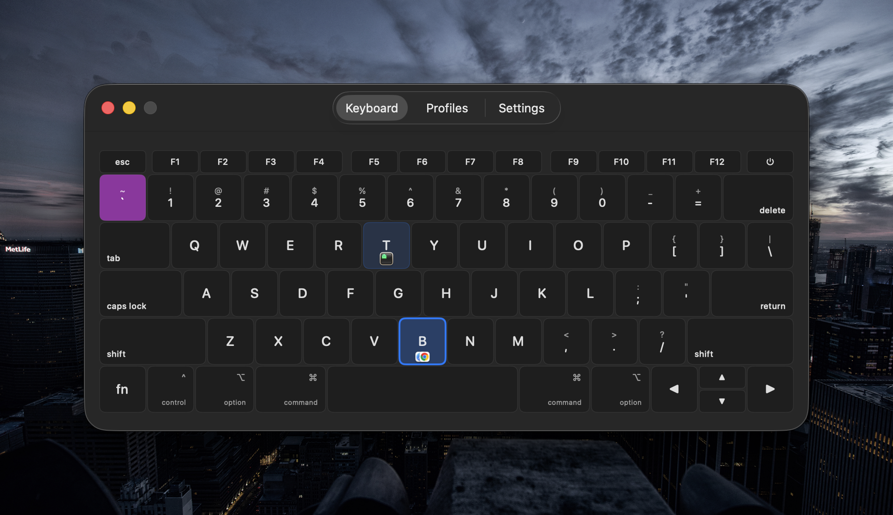
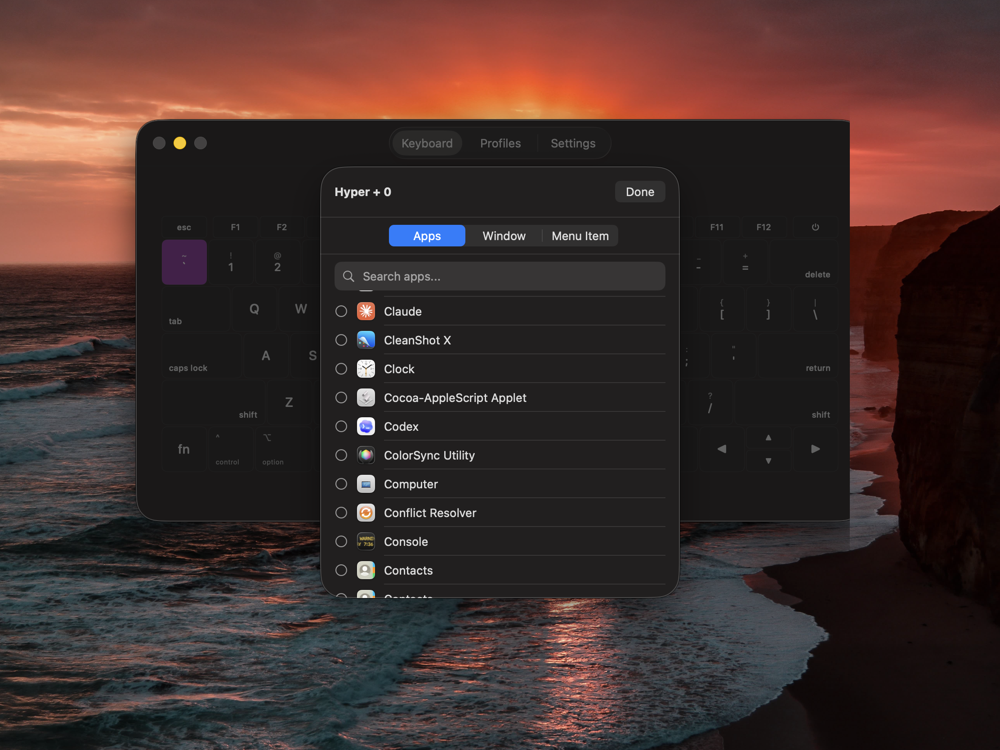
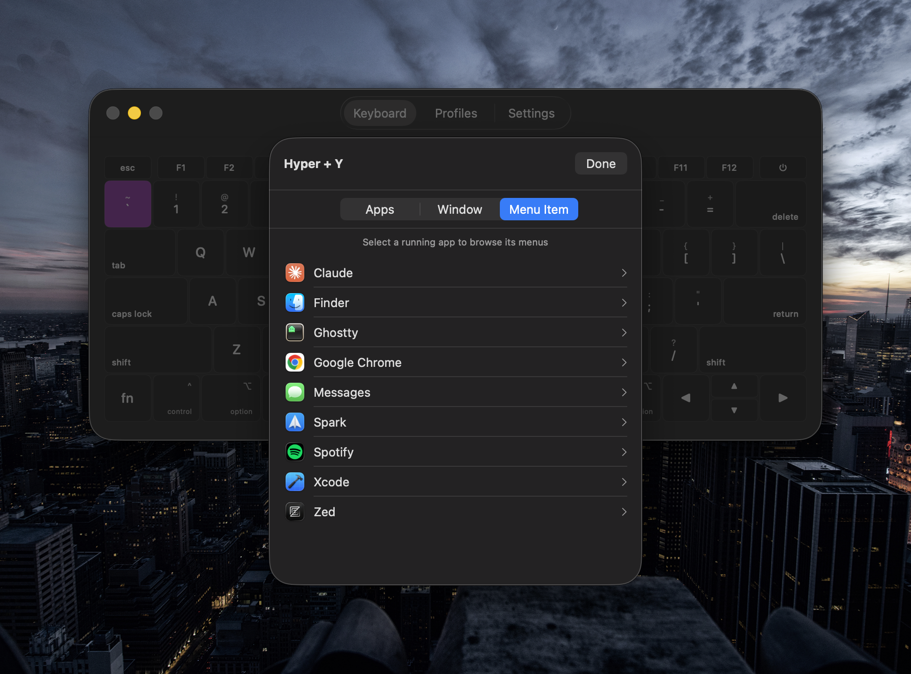
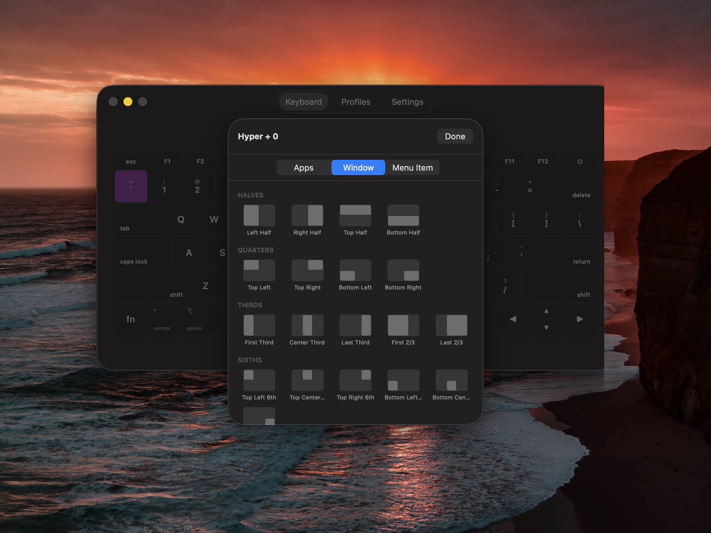
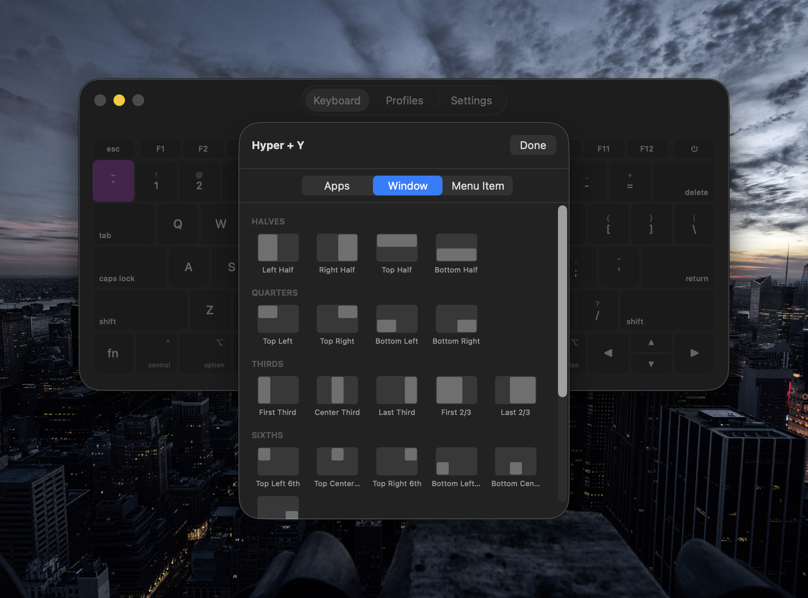

# HyperKeys

A macOS menu bar app that turns any key into a **Hyper Key** — giving you instant access to app launching, window management, and menu item shortcuts, all from a single modifier.

## Features

### Hyper Key
Remap any key (e.g. Caps Lock, backtick) to act as a Hyper Key. Tap it quickly and the original key still works. Hold it down and press another key to trigger a binding.

### App Launcher
Bind any key to instantly launch or focus an application. Select multiple apps and assign each a window position — one shortcut launches them all, tiled exactly where you want them.

### Window Management
Tile windows to halves, quarters, thirds, sixths, or fourths — plus full screen, center, and reasonable size presets. Configurable gap between tiled windows.

### Menu Item Shortcuts
Trigger any menu bar action from any running app with a key binding. Browse menus visually and bind them to your Hyper Key combos.

### Profiles
Create multiple binding profiles and switch between them. Set up automatic profile switching per-app — your bindings adapt to what you're working in.

### Double-Tap
Double-tap the Hyper Key to toggle the settings window.

## Requirements

- macOS 15.0+
- Accessibility permissions (required for key remapping and window management)

## Installation

Build from source with Xcode 16+ or download from Releases.

## License

MIT
