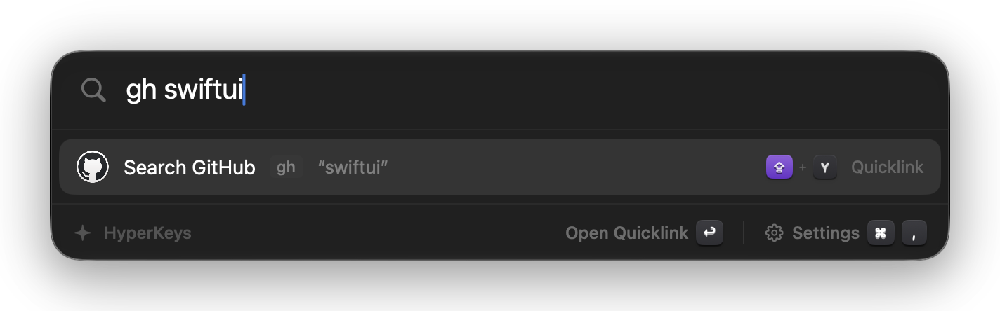
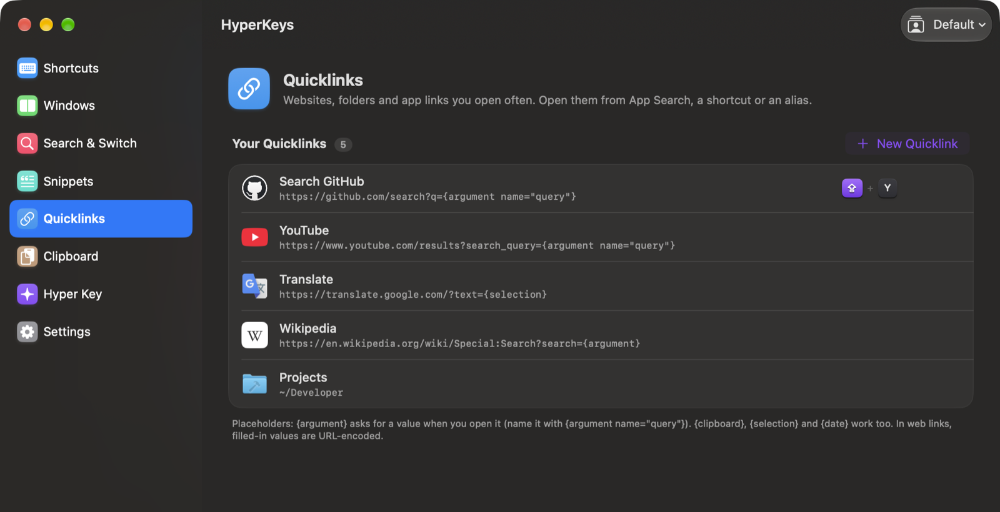
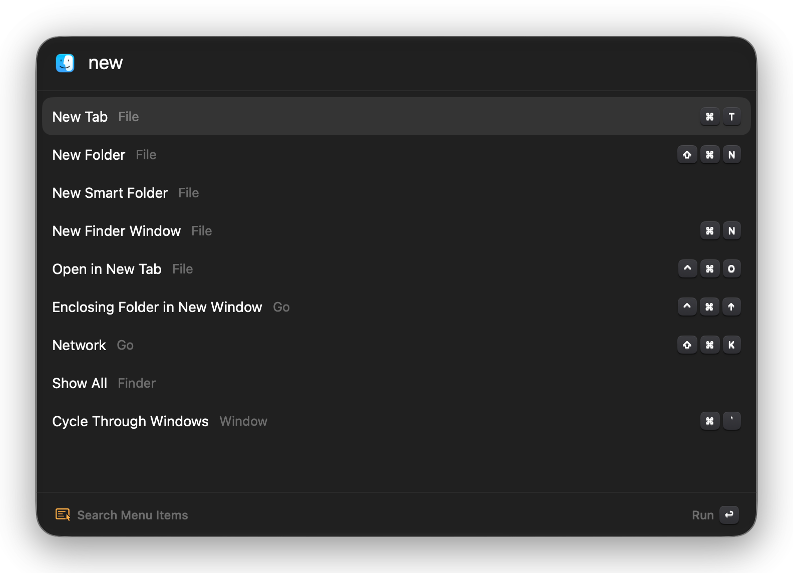
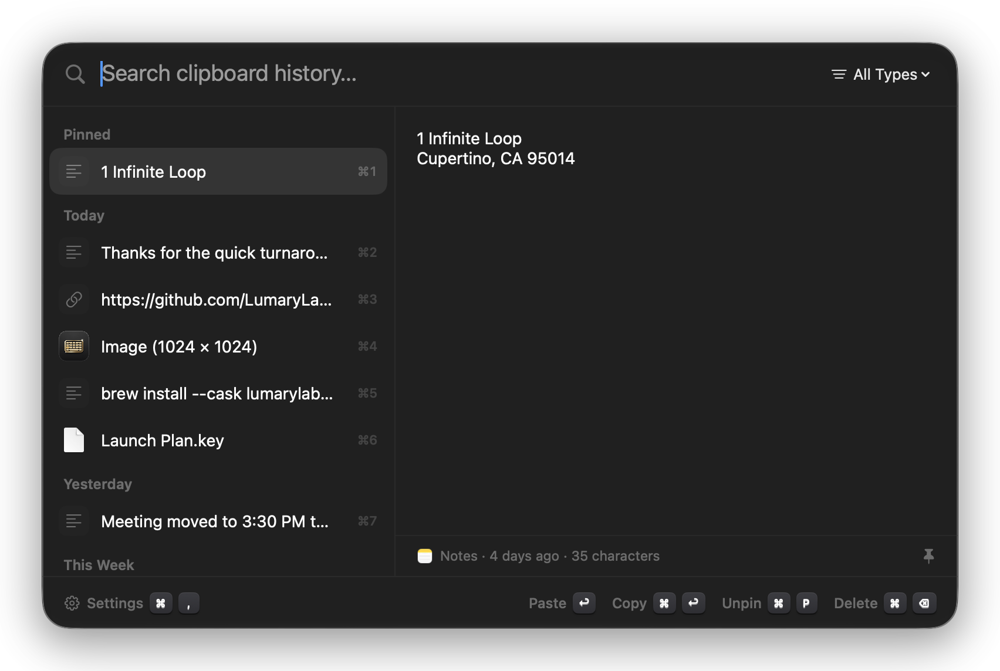
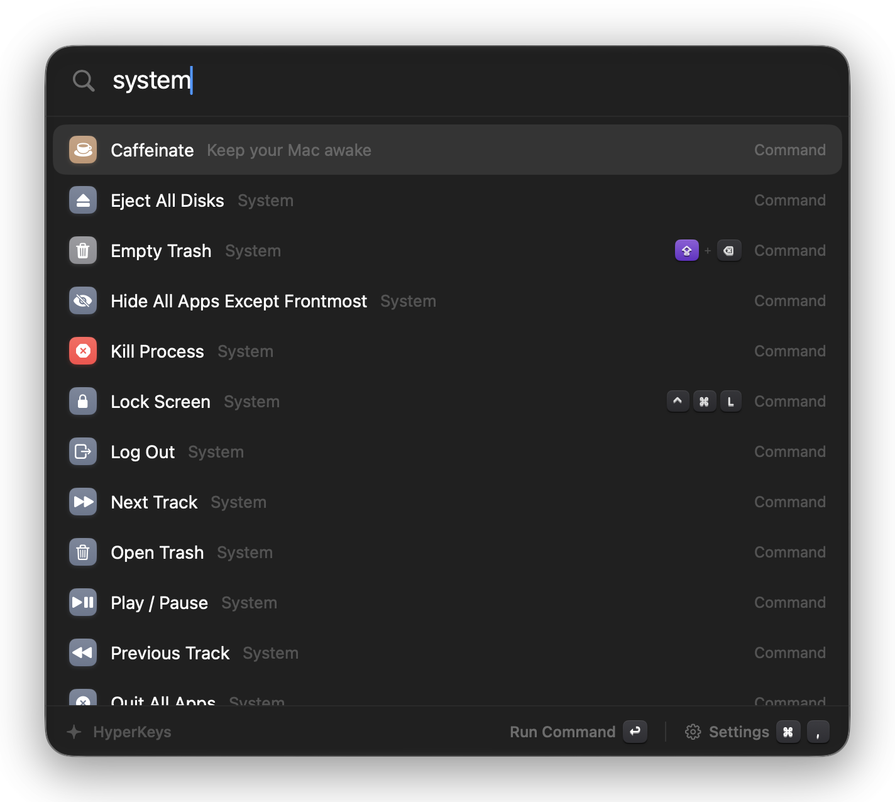

# HyperKeys

Turn Caps Lock into a **Hyper Key**. Hold it and press another key to open an app, snap a window or run a menu command. It also brings up app search, a window switcher, clipboard history, emoji, snippets and quicklinks, from anywhere on your Mac.


**What's inside**

- **Hyper shortcuts:** any key opens an app, several apps side by side, a folder, a quicklink or a menu command. Anything can use a regular shortcut like ⌥Space instead.
- **Window management:** halves, thirds, quarters, fourths, sixths, center and maximize, plus moving between displays and restoring.
- **App Search:** apps, commands, folders, quicklinks and system commands in one place, with aliases like `gh`.
- **App Switcher:** your open apps and their windows in a grid, like ⌘-Tab.
- **Clipboard History:** text, links, images and files you've copied, searchable and pinnable.
- **Snippets:** text you paste often, with keywords that expand as you type and placeholders like `{clipboard}` and `{date}`.
- **Quicklinks:** websites, folders and app links, with `{argument}` to search as you open them.
- **Search Menu Items:** run any menu command in the app you're using.
- **GIFs:** search GIPHY and Klipy, then copy or paste a GIF or clip, with favorites and recents.
- **Emoji & Symbols**, **Kill Process**, and **system commands** like Lock Screen, Sleep, volume, Dark Mode and Caffeinate.
- **Profiles**, a **config file** for your dotfiles, **iCloud sync**, **deeplinks** for scripts, and **import from Raycast**.

## Install

With [Homebrew](https://brew.sh):

```sh
brew install --cask lumarylabsllc/tap/hyperkeys
```

Or download `HyperKeys.zip` from the [latest release](https://github.com/LumaryLabsLLC/hyperkeysapp/releases/latest), unzip it and move **HyperKeys.app** to Applications.

Open HyperKeys; it lives in the menu bar. Grant **Accessibility** (to move windows and read menus) and **Input Monitoring** (to notice the Hyper Key) when it asks. HyperKeys needs macOS 15 or later.

## How It Works

Hold the Hyper Key (**Caps Lock** unless you pick another) and press a key to run its shortcut. Caps Lock stops toggling capitals while HyperKeys is running. Double-tap the Hyper Key to open the HyperKeys window.

On the **Shortcuts** page, click a key on the keyboard, or just press it, to give it a shortcut. A key can:

- open an app, or several apps tiled side by side
- snap the window you're using to a layout
- run a menu command in any app
- open a folder
- open App Search, the App Switcher, Emoji & Symbols, Snippets, Clipboard History or Kill Process
- lock the screen, sleep, log out, restart, shut down, empty the Trash, or keep your Mac awake

Anything can use a regular shortcut like **⌥Space** or **⌃⌘L** instead of the Hyper Key. When you record a shortcut, press a key on its own for Hyper + that key, or hold ⌘, ⌃ or ⌥ for a regular shortcut. Regular shortcuts are listed under **Other Shortcuts** at the bottom of the Shortcuts page.

## Features

### Window Management

Snap the window you're using to halves, quarters, thirds, two-thirds, fourths, three-fourths or sixths, or center it, maximize it or almost maximize it. You can also:
- move it to the next or previous display
- push it against an edge without resizing it
- toggle macOS full screen
- **Restore** it to where it was before

Give each layout or move a shortcut on the **Windows** page, and choose how much space to leave between tiled windows. Turn on **Repeat Left or Right Half** to make a second press go from ½ to ⅔ to ⅓ of the screen.


### App Search

**Hyper + Space** searches your apps, HyperKeys' commands, quicklinks, system commands and the folders you've given shortcuts. Anything with a shortcut shows it on the right. **⌘,** opens settings.

**Aliases** are short names you choose, like `gh` for a GitHub quicklink or `lh` for Left Half. Type one and that item comes first. Text after a quicklink's alias fills in its `{argument}`, so `gh swiftui` searches GitHub straight away. An alias can also name things App Search doesn't list, like a menu command. Add aliases under **Aliases** on the **Search & Switch** page, or in a quicklink's editor.




### App Switcher

**Hyper + Tab** shows your open apps in a grid. An app with several windows becomes a stack you can open. Keep holding Hyper and tap Tab to move, like ⌘-Tab. Or choose **Stay open** to move with h j k l, filter with `/`, and press `f` to jump by letter.


### Emoji & Symbols

Every emoji, plus arrows, math, currency and ⌘⌥⇧ key symbols, with the ones you used recently first. Move with the arrow keys or h j k l. **Return** pastes into the app you were in, and **⌘Return** copies. Give it a shortcut on the **Search & Switch** page.


### Snippets

Save text you type often and paste it anywhere. Search by name, keyword, tag or text. **Return** pastes into the app you were in, and **⌘Return** copies.

Give a snippet a **keyword**, like `;addr`, and typing it anywhere replaces it with the snippet. It never fires in password fields, or while you're typing in HyperKeys. Placeholders like `{clipboard}`, `{date}` and `{argument}` are filled in either way, and `{argument}` asks you for a value first.


### Quicklinks

Save the websites, folders and app links you open often, on the **Quicklinks** page. Open them from App Search, or give each one a shortcut or an alias. Add `{argument}` to a link and HyperKeys asks for the value when you open it. For example, `https://github.com/search?q={argument}` searches GitHub for whatever you type. Web links show the site's own icon.



### Search Menu Items

Find any menu command in the app you're using and press Return to run it. Each item shows its own keyboard shortcut, so you learn them as you go. Open it from App Search, or give it a shortcut on the **Search & Switch** page.



### GIFs

Search GIPHY GIFs, GIPHY Clips (short videos with sound) and Klipy from anywhere. **Return** copies the GIF, **⌘Return** pastes it into the app you were in, **⌘F** stars it, and **Tab** switches source. Your favorites and recently used GIFs have their own sources too. Open it from App Search, or give it a shortcut on the **Search & Switch** page.

GIPHY and Klipy each need a free API key. Paste yours into the panel the first time, or on the **Search & Switch** page. Get one from [GIPHY](https://developers.giphy.com/dashboard/) or [Klipy](https://partner.klipy.com/). Keys are kept in your keychain, not in `config.json`.

### Clipboard History

Everything you copy (text, links, images and files) is kept, so you can search it and paste it again. Open it with a Hyper shortcut or a regular one like **⇧⌘V**, set on the **Clipboard** page. **Return** pastes into the app you were in, **⌘Return** copies, **⌘1–9** pastes by position, and **⌘P** pins.

History stays on this Mac. It isn't in `config.json` and isn't synced. Passwords and anything else an app marks as private are never saved, and password managers are left out from the start. You choose how long to keep it, from a day to a year.



### Kill Process

Every app and process with its CPU and memory use. An app's helper processes are grouped with it. Sort by CPU, memory or name, filter by name, then press **Return** to quit or **⌘Return** to force quit. Open it from App Search, or give it a shortcut on the **Search & Switch** page.

### System Commands

Type "system" in App Search to see them all, or give any of them a shortcut:

- **Power:** Lock Screen, Sleep, Sleep Displays, Show Screen Saver, Log Out, Restart, Shut Down
- **Audio:** Play / Pause, Next Track, Previous Track, Toggle Mute, Turn Volume Up and Down, Set Volume to 0–100%, Toggle Microphone Mute
- **Appearance and files:** Toggle System Appearance (Dark Mode), Open Trash, Empty Trash, Eject All Disks, Toggle Hidden Files
- **Apps:** Hide All Apps Except Frontmost, Unhide All Hidden Apps, Quit All Apps, Quit All Apps Except Frontmost, Kill Process

Log Out, Restart and Shut Down ask first, the same way the Apple menu does. Empty Trash and the two Quit All commands ask first too. **Caffeinate** keeps your Mac awake until you turn it off. Find it in App Search, on a shortcut, or as **Keep Mac Awake** in the menu bar.



### Choosing the Hyper Key

Caps Lock is the default. Backtick and Tab work too; a quick tap still types them. You can also pick any other key, or a keyboard's own Hyper key that sends ⌃⌥⇧⌘, like a Kinesis.


### Profiles

Make profiles, say Work and Gaming, from the profile menu at the top right of the window. Switch between them there or from the menu bar.

## Configuration File

Everything you set up in HyperKeys is saved to a plain JSON file:

```
~/.config/hyperkeys/config.json      ($XDG_CONFIG_HOME/hyperkeys/config.json if set)
```

Edit it by hand or keep it in your dotfiles. HyperKeys reloads it whenever it changes, and if it's a symlink (stow, chezmoi, …) HyperKeys writes through the link instead of replacing it. If the file has a mistake, HyperKeys keeps your last working settings and shows the problem in **Settings → Configuration**.

```json
{
  "hyperKey": "capsLock",
  "windowGap": "small",
  "appSwitcher": "hold",
  "doubleTapOpensWindow": true,
  "shortcuts": [
    { "key": "t", "openApp": "com.mitchellh.ghostty", "name": "Ghostty" },
    { "key": "w", "name": "Work", "openApps": [
        { "app": "com.apple.Safari", "window": "leftHalf" },
        { "app": "com.tinyspeck.slackmacgap", "window": "rightHalf" }
    ] },
    { "key": "h", "window": "leftHalf" },
    { "key": "l", "window": "rightHalf" },
    { "key": "d", "menu": { "app": "com.google.Chrome", "path": ["View", "Developer", "Developer Tools"] } },
    { "key": "f", "openFolder": "~/Downloads" },
    { "key": "g", "quicklink": "Search GitHub" },
    { "key": "space", "command": "appSearch" },
    { "key": "tab", "command": "appSwitcher" }
  ],
  "profiles": [
    { "name": "Gaming", "shortcuts": [ { "key": "s", "openApp": "com.valvesoftware.steam" } ] }
  ],
  "snippets": [
    { "name": "Linkedin", "text": "https://linkedin.com/in/you", "tags": ["social"] },
    { "name": "Sign-off", "text": "Thanks,\nYou\n\nSent {date}" }
  ],
  "quicklinks": [
    { "name": "Search GitHub", "link": "https://github.com/search?q={argument name=\"query\"}" }
  ],
  "hotkeys": [
    { "shortcut": "shift+cmd+v", "command": "clipboardHistory" },
    { "shortcut": "ctrl+cmd+l", "command": "lockScreen" }
  ],
  "aliases": [
    { "alias": "gh", "quicklink": "Search GitHub" },
    { "alias": "lh", "window": "leftHalf" }
  ]
}
```

| Field | Values |
|---|---|
| `hyperKey` | `capsLock`, `backtick`, `tab`, `keyboardHyper` (a keyboard that sends ⌃⌥⇧⌘), or any key name |
| `windowGap` | `none`, `small`, `medium`, `large`, `extraLarge` |
| `appSwitcher` | `hold` (⌘-Tab style) or `stayOpen` (navigate with h j k l) |
| `key` | `a`–`z`, `0`–`9`, `f1`–`f12`, `space`, `tab`, `return`, `delete`, `left`, `right`, `up`, `down`, `backtick`, `minus`, `equals`, `leftBracket`, `rightBracket`, `backslash`, `semicolon`, `quote`, `comma`, `period`, `slash` |
| action | one of `openApp` (bundle id), `openApps`, `window` (a layout or move such as `leftHalf`, `center`, `topRightSixth`, `nextDisplay`, `restore`), `menu`, `openFolder` (a path; `~` works), `quicklink` (a quicklink's name), or `command` (`appSearch`, `appSwitcher`, `emojiPicker`, `snippets`, `clipboardHistory`, `killProcess`, `menuSearch`, `gifSearch`, `emptyTrash`, or a system command listed below) |
| `snippets` | `name`, `text`, and optional `tags` and `keyword` (typed anywhere, it turns into the snippet). Placeholders (below) are filled in when you paste. |
| `hotkeys` | regular shortcuts: `shortcut` (`ctrl`, `opt`, `shift`, `cmd` and a key, joined with `+`; needs ⌃, ⌥ or ⌘ unless it's an F key) plus one action, written like in `shortcuts` |
| `aliases` | `alias` (one word, typed in App Search) plus one action, written like in `shortcuts` |
| `quicklinks` | `name`, `link` (a web address, a path like `~/Projects`, or an app link like `slack://`) and optional `openWith` (bundle id). A shortcut opens one with `"quicklink": "Name"`. |

**Placeholders** work in snippets and quicklinks:
- `{clipboard}`, plus older copies with `{clipboard offset=1}`
- `{selection}`, the text selected in the app you're in
- `{argument}`, which asks you for a value. Name it with `name="query"`, and add `default="…"` or `options="a, b"`.
- `{date}`, `{time}`, `{datetime}` and `{day}`, which take `format="yyyy-MM-dd"`, `offset="+2d"` and `locale="fr-FR"`
- `{uuid}`, `{snippet name="Signature"}`, and `{cursor}` (removed)

Add modifiers with `|`: `{clipboard | trim | uppercase}`. The others are `lowercase`, `percent-encode`, `json-stringify` and `raw`. Values filled into web links are URL-encoded unless you add `| raw`.

System commands: `lockScreen`, `sleep`, `sleepDisplays`, `screenSaver`, `logOut`, `restart`, `shutDown`, `caffeinate`, `playPause`, `nextTrack`, `previousTrack`, `toggleMute`, `volumeUp`, `volumeDown`, `volume0`, `volume25`, `volume50`, `volume75`, `volume100`, `toggleMicrophone`, `toggleDarkMode`, `openTrash`, `ejectAllDisks`, `toggleHiddenFiles`, `hideOtherApps`, `unhideAllApps`, `quitAllApps`, `quitOtherApps`.

`"enabled": false` keeps a shortcut in the file without it doing anything. The `shortcuts` list is the Default profile; `profiles` adds named ones. The active profile is chosen per Mac.

### Deeplinks

`hyperkeys://` links run HyperKeys from scripts, the Shortcuts app, other launchers or a browser. Right-click a shortcut, alias or quicklink in HyperKeys and choose **Copy Deeplink**, or write one yourself:

| Link | Does |
|---|---|
| `hyperkeys://command/clipboardHistory` | any `command` from the config file, like `appSearch`, `lockScreen` or `caffeinate` |
| `hyperkeys://window/leftHalf` | a window layout or move, for the window in front |
| `hyperkeys://app/com.apple.Safari` | opens an app |
| `hyperkeys://folder?path=~/Downloads` | opens a folder |
| `hyperkeys://quicklink/Search%20GitHub?argument=swiftui` | opens a quicklink, filling in its `{argument}` |
| `hyperkeys://profile/Gaming` | switches profile (`Default` for the default one) |
| `hyperkeys://settings/snippets` | opens the HyperKeys window, optionally on a page (`shortcuts`, `windows`, `appSearch`, `snippets`, `quicklinks`, `clipboard`, `hyperKey`, `settings`) |
| `hyperkeys://pause`, `hyperkeys://resume` | pauses or resumes all shortcuts |

From Terminal: `open "hyperkeys://window/center"`. Any web page can ask to open these links (your browser asks you first), so they only run what a shortcut could. They never paste snippets, click menu items, or open files.

### Import from Raycast

Open **Settings → Configuration → Import from Raycast** (also on the Shortcuts and Snippets pages) and choose an export:

- **Shortcuts and snippets:** run **Export Settings & Data** in Raycast and choose the `.rayconfig` file. HyperKeys asks for the export password.
- **Just snippets:** run **Export Snippets** in Raycast and choose the `.json` file.

Before anything is added, you see every snippet and shortcut it found and pick what to keep. Raycast shortcuts that use Hyper (⌃⌥⇧⌘) become Hyper shortcuts on the same key. Others are listed separately, and you can turn one on to use its key with Hyper. This covers apps, window layouts, emoji, Search Snippets, Clipboard History, Search Menu Items, Kill Process, Caffeinate, system commands, Empty Trash, Switch Windows and quicklinks, which come over as HyperKeys quicklinks. Snippets keep their keywords. Shortcuts that would replace one you already have start unchecked. Your Raycast clipboard history doesn't come over.

### iCloud Sync

Turn on **Settings → Configuration → Sync with iCloud Drive** to use the same config on all your Macs. HyperKeys moves `config.json` into **iCloud Drive › HyperKeys** and leaves a symlink at `~/.config/hyperkeys/config.json`, so both paths keep working. If iCloud already has a config from another Mac, you choose which one to keep. If your config is already linked into your dotfiles, sync it from there instead.

### Reset

**Settings → Reset all settings** puts your shortcuts, Hyper Key, aliases, profiles and options back to how HyperKeys starts. Your snippets, quicklinks and clipboard history stay, unless you choose **Reset Everything**. A copy of your old `config.json` is saved in `~/Library/Application Support/HyperKeys/Backups` first.

## Building from Source

```
git clone https://github.com/LumaryLabsLLC/hyperkeysapp.git
cd hyperkeysapp
open HyperKeys.xcworkspace
```

Build and run the **HyperKeys** scheme in Xcode 26 or later.

`Scripts/release.sh` makes a release build. It builds a universal app signed with Developer ID, notarizes and staples it, and writes `build/release/HyperKeys.zip` with its SHA-256 for the Homebrew cask.

## License

MIT

## Links

- [GitHub](https://github.com/LumaryLabsLLC/hyperkeysapp)
- [Lumary Labs](https://lumarylabs.com/)
