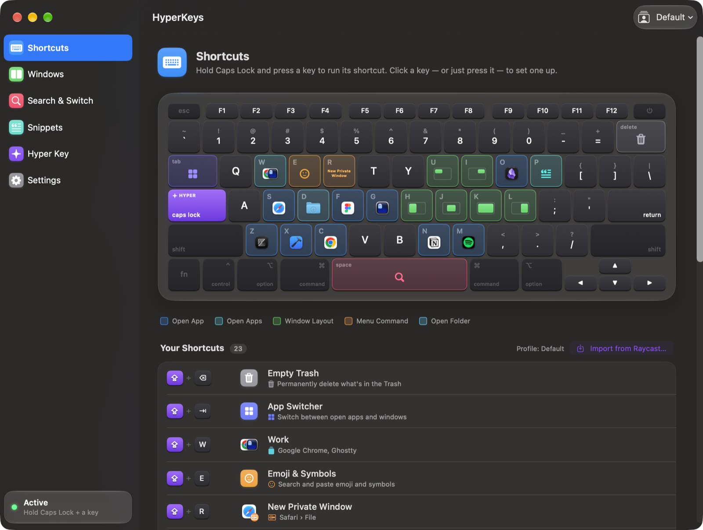
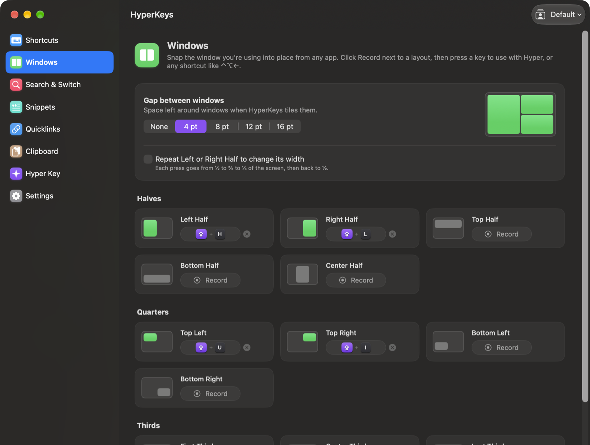
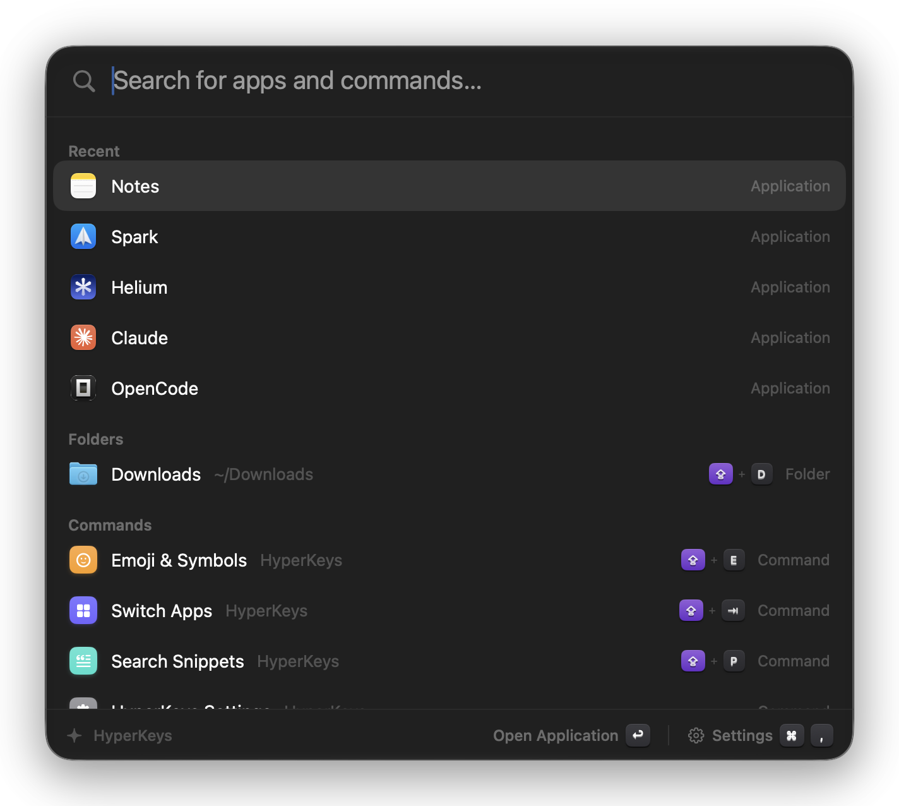
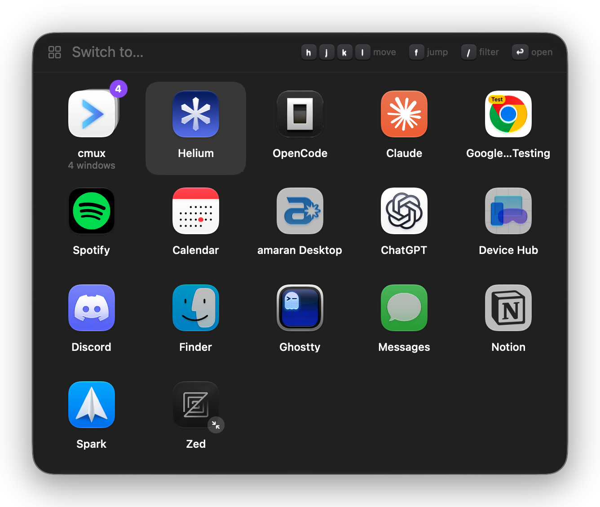
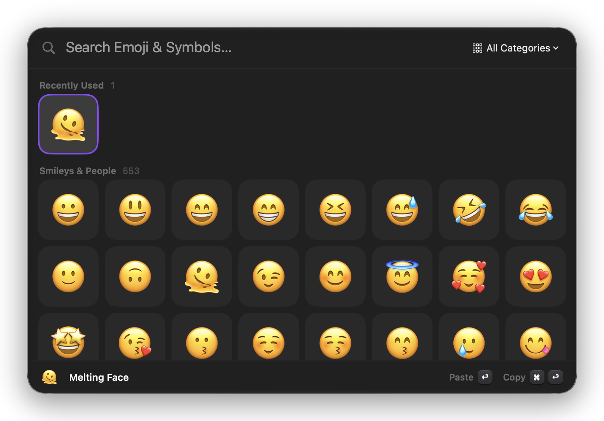
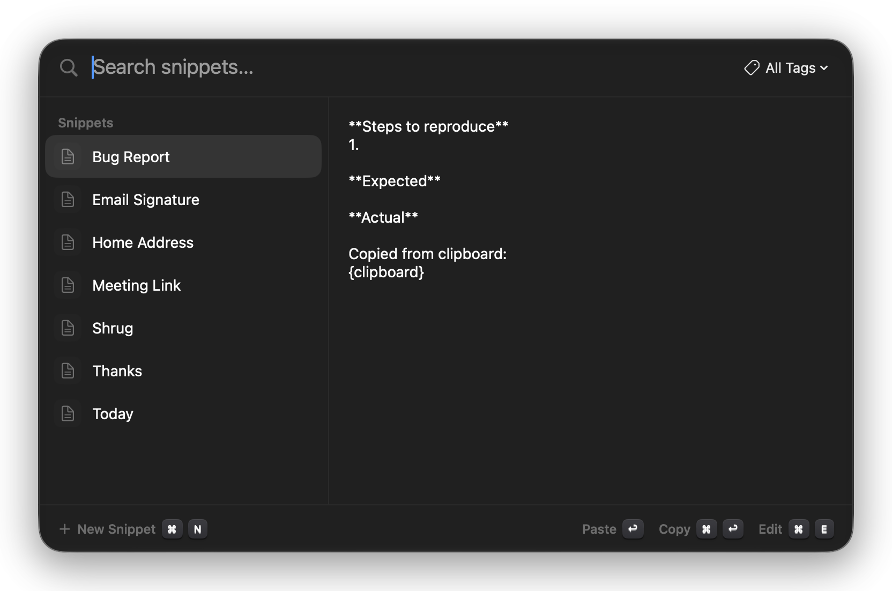
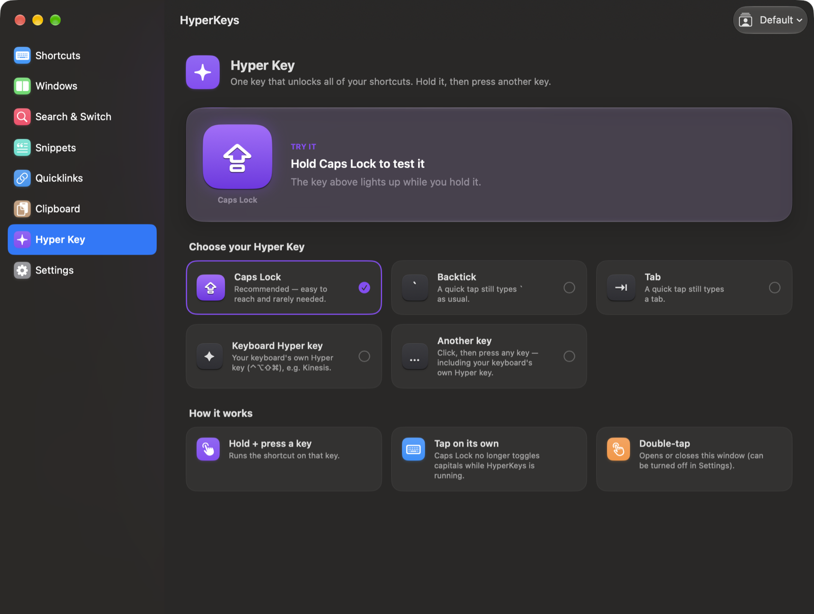

# HyperKeys

Turn Caps Lock into a **Hyper Key**. Hold it and press another key to open an app, snap a window or run a menu command. It also brings up app search, a window switcher, emoji and your snippets, from anywhere on your Mac.



## Install

With [Homebrew](https://brew.sh):

```sh
brew install --cask lumarylabsllc/tap/hyperkeys
```

Or download `HyperKeys.zip` from the [latest release](https://github.com/LumaryLabsLLC/hyperkeysapp/releases/latest), unzip it and move **HyperKeys.app** to Applications.

Open HyperKeys; it lives in the menu bar. Grant **Accessibility** (to move windows and read menus) and **Input Monitoring** (to notice the Hyper Key) when it asks. HyperKeys needs macOS 15 or later.

## How It Works

Hold the Hyper Key (**Caps Lock** unless you pick another) and press a key to run its shortcut. Caps Lock stops toggling capitals while HyperKeys is running. Double-tap the Hyper Key to open the HyperKeys window.

On the **Shortcuts** page, click a key on the keyboard, or just press it, to give it a shortcut. A key can:

- open an app, or several apps tiled side by side
- snap the window you're using to a layout
- run a menu command in any app
- open a folder
- open App Search, the App Switcher, Emoji & Symbols or Snippets, or empty the Trash

## Features

### Window Management

Snap the window you're using to halves, quarters, thirds, fourths or sixths. You can also center it or fill the screen. Give each layout a key on the **Windows** page, and choose how much space to leave between tiled windows.



### App Search

**Hyper + Space** searches your apps, HyperKeys' commands and the folders you've given shortcuts. Apps with a Hyper shortcut show it on the right. **⌘,** opens settings.



### App Switcher

**Hyper + Tab** shows your open apps in a grid. An app with several windows becomes a stack you can open. Keep holding Hyper and tap Tab to move, like ⌘-Tab. Or choose **Stay open** to move with h j k l, filter with `/`, and press `f` to jump by letter.



### Emoji & Symbols

Every emoji, plus arrows, math, currency and ⌘⌥⇧ key symbols, with the ones you used recently first. Move with the arrow keys or h j k l. **Return** pastes into the app you were in, and **⌘Return** copies. Give it a key on the **Search & Switch** page.



### Snippets

Save text you type often and paste it anywhere. Search by name, tag or text. **Return** pastes into the app you were in, and **⌘Return** copies. Placeholders like `{clipboard}` and `{date}` are filled in when you paste.



### Choosing the Hyper Key

Caps Lock is the default. Backtick and Tab work too; a quick tap still types them. You can also pick any other key, or a keyboard's own Hyper key that sends ⌃⌥⇧⌘, like a Kinesis.



### Profiles

Make profiles, say Work and Gaming, from the profile menu at the top right of the window. Switch between them there or from the menu bar.

## Configuration File

Everything you set up in HyperKeys is saved to a plain JSON file:

```
~/.config/hyperkeys/config.json      ($XDG_CONFIG_HOME/hyperkeys/config.json if set)
```

Edit it by hand or keep it in your dotfiles. HyperKeys reloads it whenever it changes, and if it's a symlink (stow, chezmoi, …) HyperKeys writes through the link instead of replacing it. If the file has a mistake, HyperKeys keeps your last working settings and shows the problem in **Settings → Configuration**.

```json
{
  "hyperKey": "capsLock",
  "windowGap": "small",
  "appSwitcher": "hold",
  "doubleTapOpensWindow": true,
  "shortcuts": [
    { "key": "t", "openApp": "com.mitchellh.ghostty", "name": "Ghostty" },
    { "key": "w", "name": "Work", "openApps": [
        { "app": "com.apple.Safari", "window": "leftHalf" },
        { "app": "com.tinyspeck.slackmacgap", "window": "rightHalf" }
    ] },
    { "key": "h", "window": "leftHalf" },
    { "key": "l", "window": "rightHalf" },
    { "key": "d", "menu": { "app": "com.google.Chrome", "path": ["View", "Developer", "Developer Tools"] } },
    { "key": "f", "openFolder": "~/Downloads" },
    { "key": "space", "command": "appSearch" },
    { "key": "tab", "command": "appSwitcher" }
  ],
  "profiles": [
    { "name": "Gaming", "shortcuts": [ { "key": "s", "openApp": "com.valvesoftware.steam" } ] }
  ],
  "snippets": [
    { "name": "Linkedin", "text": "https://linkedin.com/in/you", "tags": ["social"] },
    { "name": "Sign-off", "text": "Thanks,\nYou\n\nSent {date}" }
  ]
}
```

| Field | Values |
|---|---|
| `hyperKey` | `capsLock`, `backtick`, `tab`, `keyboardHyper` (a keyboard that sends ⌃⌥⇧⌘), or any key name |
| `windowGap` | `none`, `small`, `medium`, `large`, `extraLarge` |
| `appSwitcher` | `hold` (⌘-Tab style) or `stayOpen` (navigate with h j k l) |
| `key` | `a`–`z`, `0`–`9`, `f1`–`f12`, `space`, `tab`, `return`, `delete`, `left`, `right`, `up`, `down`, `backtick`, `minus`, `equals`, `leftBracket`, `rightBracket`, `backslash`, `semicolon`, `quote`, `comma`, `period`, `slash` |
| action | one of `openApp` (bundle id), `openApps`, `window` (a layout such as `leftHalf`, `center`, `topRightSixth`), `menu`, `openFolder` (a path; `~` works), or `command` (`appSearch`, `appSwitcher`, `emojiPicker`, `snippets`, `emptyTrash`) |
| `snippets` | `name`, `text` and optional `tags`. `{clipboard}`, `{date}`, `{time}`, `{datetime}`, `{day}` and `{uuid}` are filled in when you paste; dates take a format, like `{date format="yyyy-MM-dd"}`. `{cursor}` is removed. |

`"enabled": false` keeps a shortcut in the file without it doing anything. The `shortcuts` list is the Default profile; `profiles` adds named ones. The active profile is chosen per Mac.

### Import from Raycast

Open **Settings → Configuration → Import from Raycast** (also on the Shortcuts and Snippets pages) and choose an export:

- **Shortcuts and snippets:** run **Export Settings & Data** in Raycast and choose the `.rayconfig` file. HyperKeys asks for the export password.
- **Just snippets:** run **Export Snippets** in Raycast and choose the `.json` file.

Before anything is added, you see every snippet and shortcut it found and pick what to keep. Raycast shortcuts that use Hyper (⌃⌥⇧⌘) become Hyper shortcuts. This covers apps, window layouts, emoji, Search Snippets, Empty Trash, Switch Windows and quicklinks to folders. Shortcuts that would replace one you already have start unchecked. Clipboard history, web links and snippet keywords don't come over.

### iCloud Sync

Turn on **Settings → Configuration → Sync with iCloud Drive** to use the same config on all your Macs. HyperKeys moves `config.json` into **iCloud Drive › HyperKeys** and leaves a symlink at `~/.config/hyperkeys/config.json`, so both paths keep working. If iCloud already has a config from another Mac, you choose which one to keep. If your config is already linked into your dotfiles, sync it from there instead.

## Building from Source

```
git clone https://github.com/LumaryLabsLLC/hyperkeysapp.git
cd hyperkeysapp
open HyperKeys.xcworkspace
```

Build and run the **HyperKeys** scheme in Xcode 26 or later.

`Scripts/release.sh` makes a release build. It builds a universal app signed with Developer ID, notarizes and staples it, and writes `build/release/HyperKeys.zip` with its SHA-256 for the Homebrew cask.

## License

MIT

## Links

- [GitHub](https://github.com/LumaryLabsLLC/hyperkeysapp)
- [Lumary Labs](https://lumarylabs.com/)
